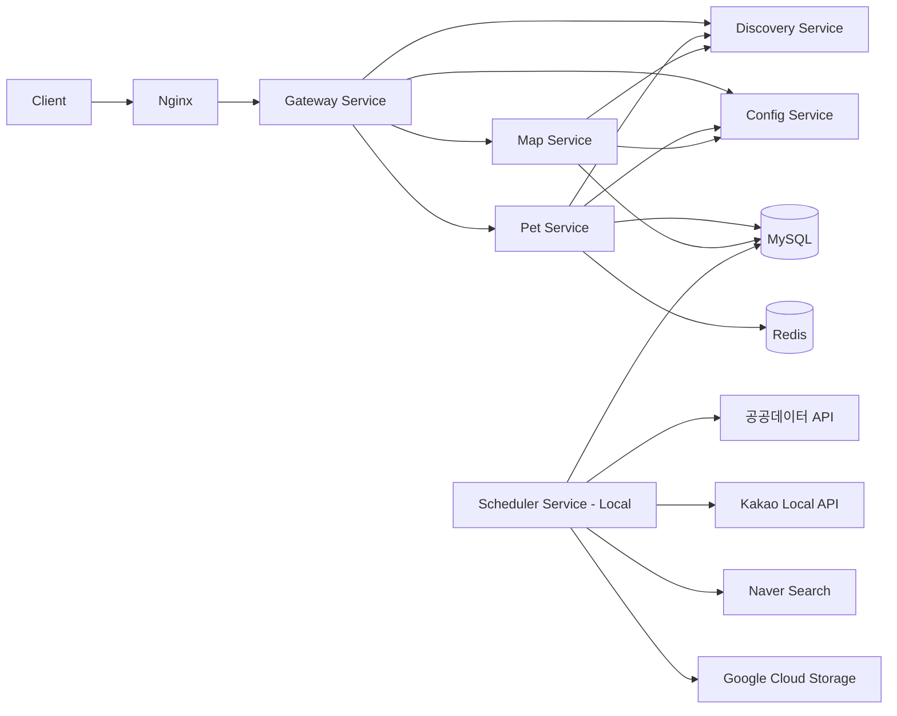

# NyangMong Backend

유기동물 정보, 동물병원/반려동물 동반 장소, 보호소, 펫 행사 정보를 제공하기 위한 Spring Boot 기반 백엔드 프로젝트입니다.

이 프로젝트는 서비스별 책임을 분리한 MSA 구조로 설계했습니다. `pet-service`, `map-service`, `gateway-service`, `config-service`, `discovery-service`, `scheduler-service`를 독립된 애플리케이션으로 구성하여 각 서비스가 자신의 역할에 집중하도록 했습니다.

특히 MSA 구조를 채택한 핵심 이유는 각 서비스의 독립성을 확보하고, 사용자 요청을 처리하는 서비스와 데이터 수집/배치 서비스를 분리하기 위해서입니다. 이 구조를 통해 `scheduler-service`를 운영 배포 대상에서 제외하더라도 실제 사용자 API 서비스는 독립적으로 배포하고 운영할 수 있습니다.

## 주요 기능

### 유기동물 조회

- 지역, 축종, 기기 타입에 따른 유기동물 목록 조회
- 유기번호 기반 유기동물 상세 조회
- RFID 기반 동물 조회
- 즐겨찾기한 유기동물 목록 조회
- 전체 유기동물 수 및 RFID 등록 동물 수 조회

### 지도/장소 정보 조회

- 지역 및 카테고리 기반 반려동물 동반 장소 조회
- 장소 상세 정보 조회
- 동물병원 지역별 목록 및 상세 조회
- 보호소 지역별 목록 및 상세 조회
- 펫 문화시설 카테고리별 조회
  - 미용
  - 카페
  - 쇼핑
  - 박물관
  - 미술관
  - 문예회관
  - 약국

### 행사 정보

- 현재 진행 중이거나 예정된 펫 행사 목록 조회
- 행사 상세 조회
- 행사 지역 목록 조회
- 지역별 행사 목록 조회

### 데이터 수집 및 배치

- 공공데이터 API 기반 유기동물 정보 동기화
- 공공데이터 API 기반 반려동물 동반 관광지/장소 정보 동기화
- 보호소 정보 동기화
- CSV 기반 동물병원, 반려동물 문화시설, 견종/묘종 데이터 적재
- Naver 검색 결과 기반 펫 행사 크롤링
- Kakao Local API를 활용한 행사 주소 보정
- Google Cloud Storage 기반 이미지 저장 연동

## 기술 스택

| 구분 | 기술 |
| --- | --- |
| Language | Java 17 |
| Framework | Spring Boot 3.5.9, Spring Cloud 2025.0.1 |
| API Gateway | Spring Cloud Gateway, WebFlux |
| Service Discovery | Netflix Eureka |
| Config Management | Spring Cloud Config Server |
| Persistence | Spring Data JPA, Spring Data JDBC, MySQL 8.0 |
| Cache / Rate Limit | Redis 7.2 |
| Batch | Spring Batch, Spring Scheduler |
| Query | JPQL, QueryDSL |
| Security | Spring Security, JWT |
| API Docs | Springdoc OpenAPI / Swagger |
| Crawling | Selenium, WebDriverManager |
| External API | 공공데이터포털 API, Kakao Local API, Naver Search, Google Cloud Storage |
| Infra | Docker, Docker Compose, Nginx, Certbot |
| Build | Gradle |

## 서비스 구조

```text
stray_real
├── config-service       # Spring Cloud Config Server
├── discovery-service    # Eureka Service Registry
├── gateway-service      # 외부 요청 진입점 및 JWT 검증/라우팅
├── pet-service          # 유기동물 검색, 상세, RFID, 즐겨찾기 API
├── map-service          # 장소, 병원, 보호소, 문화시설, 행사 API
├── scheduler-service    # 공공 API/CSV/크롤링 기반 데이터 동기화 및 배치
└── docker-compose.yml   # 운영 대상 서비스와 인프라 실행 구성
```

## 아키텍처



## 설계 방향

### MSA 기반 서비스 분리

유기동물 조회, 지도/장소 조회, 데이터 수집/배치 작업은 각각 성격과 변경 주기가 다릅니다. 그래서 하나의 애플리케이션에 모든 기능을 넣기보다, 역할별로 서비스를 분리했습니다.

- `gateway-service`는 클라이언트 요청의 단일 진입점 역할을 하며, JWT 검증과 서비스 라우팅을 담당합니다.
- `pet-service`는 유기동물 도메인 API를 담당합니다.
- `map-service`는 장소, 병원, 보호소, 행사 등 지도 기반 정보 API를 담당합니다.
- `scheduler-service`는 외부 API, CSV, 크롤링 데이터를 DB에 적재하고 갱신하는 배치 작업을 담당합니다.
- `config-service`는 서비스별 설정을 중앙에서 관리합니다.
- `discovery-service`는 각 서비스 인스턴스를 등록하고 Gateway가 서비스 이름으로 라우팅할 수 있게 합니다.

이 구조를 통해 서비스별 독립성을 확보했고, 실제 사용자 요청과 무관한 `scheduler-service`는 운영 배포 대상에서 분리할 수 있도록 설계했습니다.

### Scheduler Service 분리

`scheduler-service`는 `docker-compose` 및 CI/CD 배포 대상에서 제외했습니다.

그 이유는 API를 통한 데이터 처리 및 배치 작업이 백엔드 호스팅 서버에 큰 작업이고, 서비스 이용자가 직접 호출하지 않을 서비스이기 때문입니다. 따라서 운영 환경에서는 사용자 API 처리에 필요한 서비스만 배포하고, `scheduler-service`는 CI/CD에서 제외한 뒤 로컬 환경에서 별도로 실행하며 데이터를 수집/갱신하는 방식으로 운영하고 있습니다.

이 방식은 배치 작업이 운영 서버의 CPU, 메모리, 네트워크 리소스를 과도하게 사용하지 않도록 분리하면서도, 수집된 데이터는 동일한 DB에 적재하여 `pet-service`와 `map-service`가 조회 API로 제공할 수 있게 합니다.

## 토큰 사용 방식

이 프로젝트는 로그인 기반 인증 대신 익명 사용자 토큰 방식을 사용합니다.

1. 클라이언트는 최초 접근 시 fingerprint 값을 생성합니다.
2. 클라이언트는 `X-Fingerprint` 헤더와 `User-Agent` 정보를 포함해 토큰 발급을 요청합니다.
3. `pet-service`의 토큰 발급 API는 Redis를 이용해 토큰 발급 요청 빈도를 검사합니다.
4. 요청이 허용되면 fingerprint, IP, User-Agent 정보를 해싱하여 익명 JWT를 발급합니다.
5. 클라이언트는 이후 API 요청마다 `Authorization: Bearer {token}` 형식으로 토큰을 전달합니다.
6. `gateway-service`는 JWT를 검증하고, 토큰 타입이 `ANONYMOUS`인지 확인한 뒤 내부 서비스로 요청을 전달합니다.
7. Gateway는 토큰에 포함된 fingerprint hash를 `X-Fingerprint-Hash` 헤더로 내부 서비스에 전달합니다.

Redis는 토큰 발급 요청의 rate limit과 임시 차단을 처리하는 데 사용됩니다. 이를 통해 별도 회원가입 없이도 사용자를 구분하고, 비정상적으로 많은 토큰 발급 요청을 제한할 수 있습니다.

## 기술 선택 이유

### Spring Boot

REST API, JPA, Security, Validation, Batch 등 백엔드에 필요한 기능을 안정적으로 통합할 수 있어 선택했습니다. 서비스별 애플리케이션을 독립 실행 가능한 형태로 구성하기에도 적합합니다.

### Spring Cloud Gateway

MSA 구조에서 클라이언트가 여러 서비스를 직접 호출하지 않도록 단일 진입점을 제공합니다. Gateway에서 라우팅과 JWT 검증을 처리해 내부 서비스는 각 도메인 로직에 집중할 수 있도록 했습니다.

### Eureka

서비스가 독립적으로 실행되기 때문에, Gateway가 각 서비스의 위치를 직접 관리하지 않고 서비스 이름 기반으로 라우팅할 수 있도록 Eureka를 사용했습니다.

### Spring Cloud Config

JWT secret, DB 접속 정보, 외부 API 키처럼 환경에 따라 달라지는 설정을 코드와 분리하기 위해 사용했습니다. 설정을 중앙화하여 여러 서비스의 환경 값을 일관되게 관리할 수 있습니다.

### MySQL + JPA

유기동물, 보호소, 병원, 장소, 행사처럼 관계형 구조가 명확한 데이터를 다루기 때문에 MySQL과 JPA를 사용했습니다. 단순 조회는 Spring Data JPA로 처리하고, 조건이 복잡한 검색은 JPQL 또는 QueryDSL을 활용했습니다.

### Spring Batch

공공데이터 API와 CSV 데이터를 수집하고 DB에 적재하는 작업은 처리량이 크고, 반복 실행과 상태 관리가 중요합니다. 이러한 배치성 작업을 안정적으로 처리하기 위해 Spring Batch를 사용했습니다.

### Redis

익명 토큰 발급 요청 제한과 fingerprint 기반 임시 차단을 위해 Redis를 사용했습니다. TTL이 필요한 보안성 데이터를 빠르게 저장하고 만료시키기에 적합합니다.

### Docker Compose

여러 마이크로서비스와 MySQL, Redis, Nginx, Certbot을 같은 네트워크에서 실행하기 위해 사용했습니다. 단, 운영 배포 구성에서는 사용자 요청 처리에 필요한 서비스 중심으로 구성하고, 무거운 배치 작업을 수행하는 `scheduler-service`는 로컬 실행 대상으로 분리했습니다.
